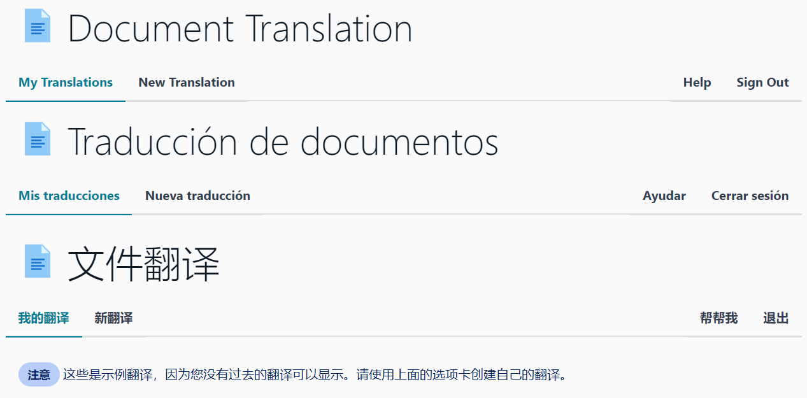

<!--
Copyright Amazon.com, Inc. or its affiliates. All Rights Reserved.
SPDX-License-Identifier: MIT-0
-->

## Documentation

- [Documentation](https://aws-samples.github.io/document-translation/)
	- [Architecture](https://aws-samples.github.io/document-translation/docs/architecture/)
	- [Installation](https://aws-samples.github.io/document-translation/docs/installation/)
	- [Quick Start](https://aws-samples.github.io/document-translation/docs/quick-start.html)
	- [FAQ](https://aws-samples.github.io/document-translation/docs/faq.html)

## Overview

The project delivers a document translation portal with a web front end and automated pipeline with machine translation powered by [Amazon Translate](https://aws.amazon.com/translate/). 

This application is capable of translating all languages supported by the Amazon Translate (75 at the time of writing) and can translate to them all in a single job submission.

User authentication is required and handled by [AWS Cognito](https://aws.amazon.com/cognito/). Cognito can be integrated into various Identity Providers including any that support SAML 2.0 (E.g. Active Directory).

## Screenshots

**Past Translations Table**

**Multiple Language UI**

**New Translations Form**

## Security

See [CONTRIBUTING](CONTRIBUTING.md#security-issue-notifications) for more information.

## License

This library is licensed under the MIT-0 License. See the LICENSE file.

## Tags, Releases, & Branches

For general use please stick with the tagged released version of the main branch. GitHub lists the available [release versions for this project](https://github.com/aws-samples/document-translation/releases). The [documentation installation wizard](https://aws-samples.github.io/document-translation/docs/installation/) will default to the latest tagged release available.

### Tags, Releases

Tags and Releases are used to mark commits considered as verions with the format of vX.Y.Z. Any other tag is simply a tag. These versioned releases are for general use to try out this project. Tags and Releases are applied to commits in the main branch when it is functional. It is recommended to try the latest release. 

### Branches

The branch `main` is used for upstream development for this project. It **may** at times be non functional and require knowledge of the project to install, update, or fix. It is not intended for general use. 

The branch `dev` is used for upstream development ahead of `main`. It **will** have components/functions/features that are non functional. It is not intended for general use. Features in this `dev` branch may not be documented until they are merged into the `main` branch. 
