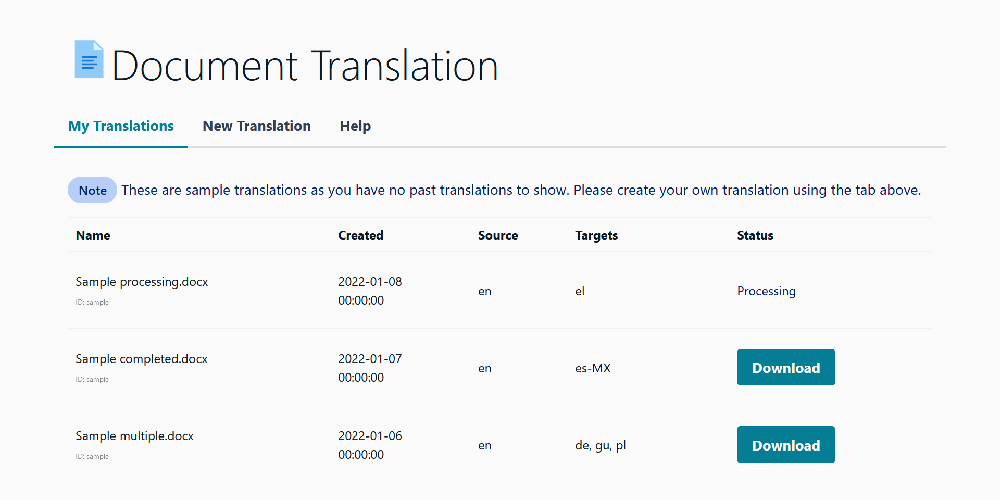
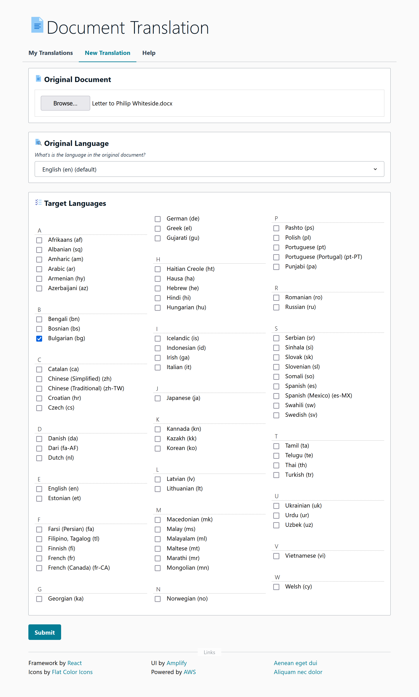

<!--
Copyright Amazon.com, Inc. or its affiliates. All Rights Reserved.
SPDX-License-Identifier: MIT-0
-->

## Document Translation

- [Architecture](docs/Architecture.md)
- Installation
  - [Installation with CloudShell and CodeCommit](docs/Installation-CodeCommit-CloudShell.md) **Recommended**
- [Customisation](docs/Customisation.md)
- [FAQ](docs/FAQ.md)

## Overview
The project delivers a document translation portal with a web front end and automated pipeline with machine translation powered by [Amazon Translate](https://aws.amazon.com/translate/). 

This application is capable of translating all languages supported by the Amazon Translate (75 at the time of writing) and can translate to them all in a single job submission.

User authentication is required and handled by [AWS Cognito](https://aws.amazon.com/cognito/). Cognito can be integrated into various Identity Providers including any that support SAML 2.0 (E.g. Active Directory).

## Screenshots

**Past Translations Table**

**New Translations Form**

## Security

See [CONTRIBUTING](CONTRIBUTING.md#security-issue-notifications) for more information.

## License

This library is licensed under the MIT-0 License. See the LICENSE file.

