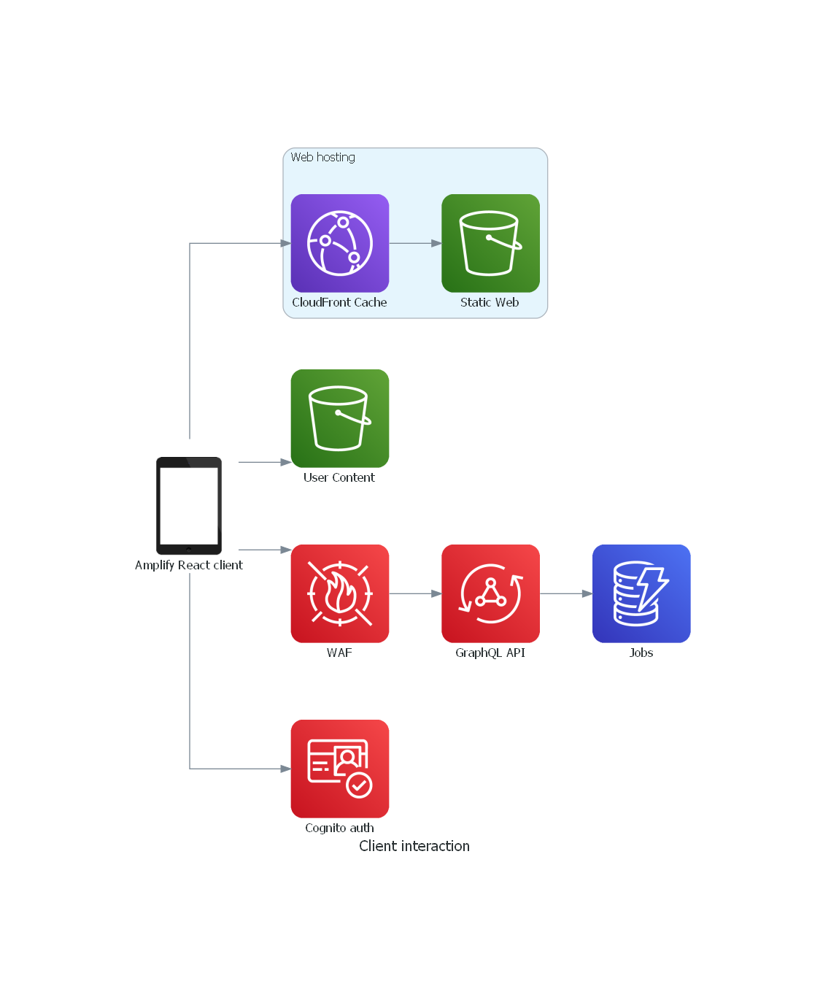
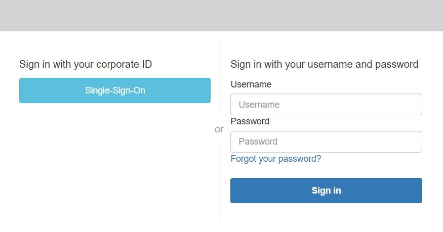
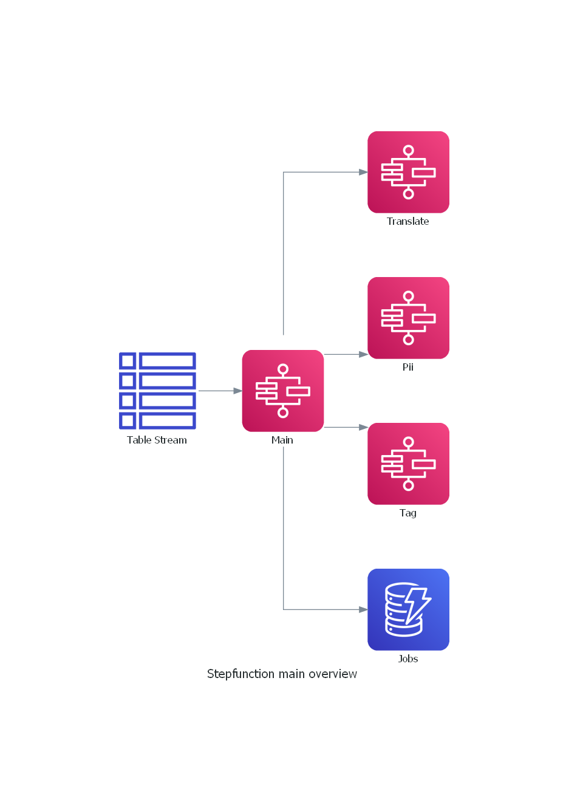
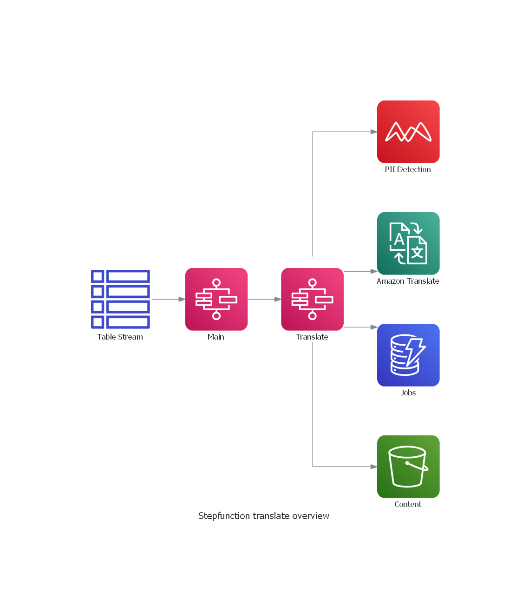
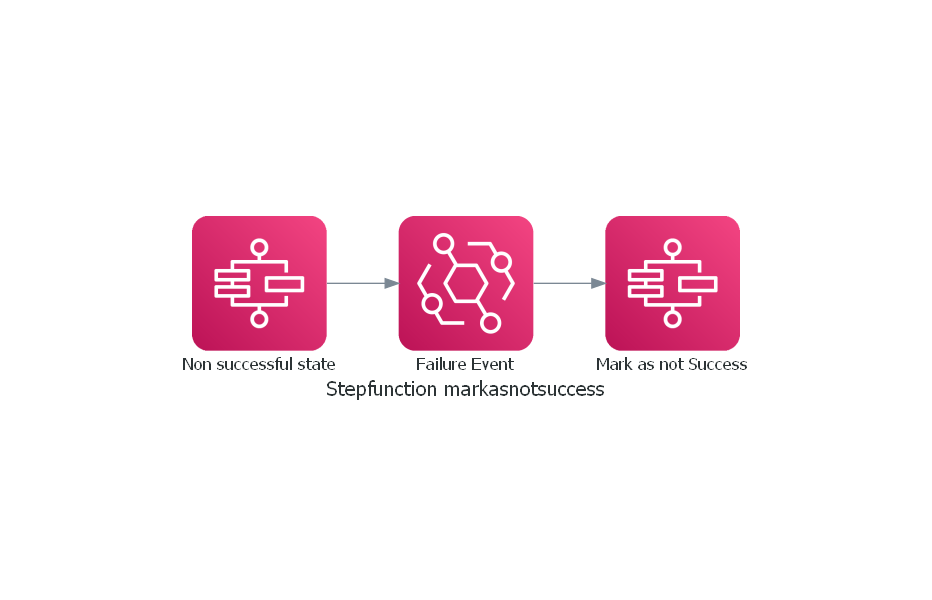
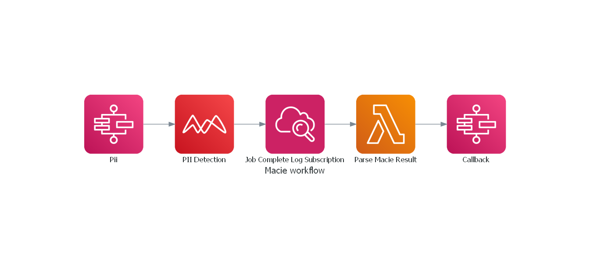
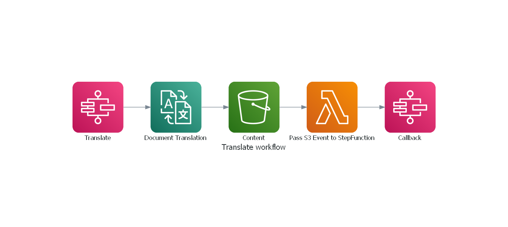

<!--
Copyright Amazon.com, Inc. or its affiliates. All Rights Reserved.
SPDX-License-Identifier: MIT-0
-->

# Architecture

## Services Used

- [Amazon CloudWatch](https://aws.amazon.com/cloudwatch/)
- [Amazon Macie](https://aws.amazon.com/macie/)
- [Amazon Translate](https://aws.amazon.com/translate/)
- [AWS AppSync](https://aws.amazon.com/appsync/)
- [AWS CloudFront](https://aws.amazon.com/cloudfront/)
- [AWS Cognito](https://aws.amazon.com/cognito/)
- [AWS DynamoDB](https://aws.amazon.com/dynamodb/)
- [AWS EventBridge](https://aws.amazon.com/eventbridge/)
- [AWS Lambda](https://aws.amazon.com/lambda/)
- [AWS S3](https://aws.amazon.com/s3/)
- [AWS StepFunctions](https://aws.amazon.com/step-functions/)
- [AWS Web Application Firewall](https://aws.amazon.com/waf/)

## Features

The solution is built with modular features in mind allowing you to enable or disable particular features that you need. The below shows the features available. 

| Feature             | Depends On  | Required  | Description                                                                 |
| ------------------- | ----------- | --------- | --------------------------------------------------------------------------- |
| Web UI              | -           | Optional  | A web UI for interacting with the solution                                  |
| Translation         | -           | Optional  | Performs translation of uploaded documents                                  |
| Translation PII     | Translation | Optional  | Performs Pii detection on uploaded files for more strict lifecycle policies |
| Cognito Local Users | -           | Optional* | Provides user authentication with local Cognito users                       |
| Cognito SAML Users  | -           | Optional* | Provides user authentication with a SAML provider                           |

\* At least one of "Cognito Local Users", "Cognito SAML Users" is required.

## Client Interaction

### Client Overview

The client is created with [React JS](https://reactjs.org/), utilising [Amplify](https://aws.amazon.com/amplify/) libraries for interaction with AWS services. Clients can perform the following:

- Authenticate
- Upload new content
- Submit a new job
- Read their past jobs
- Download their translated content



### Process Steps

1. Client authentication
2. Original content upload 
3. Job info submission (DynamoDB Stream triggers workflow)

### Client Authentication

Authentication is provided by [Cognito](https://aws.amazon.com/cognito/) and is required to use the application. Non-authenticated users are redirected to a Cognito login page. Multiple authentication options are supported:

1. Cognito SAML 2.0 Provider Users (E.g. Azure Active Directory)
2. Cognito Local Users
3. Both 



### Client Content Upload/Download

Authenticated users are able to upload/download content into/from the [S3](https://aws.amazon.com/s3/) bucket with permissions scoped to their Cognito identity. This interaction is provided by the Amplify library. [File access levels](https://docs.amplify.aws/lib/storage/configureaccess/q/platform/js/) are configured as `private`. This allows a user to upload and download their own files but not other users.

> Private: Only accessible for the individual user. Files are stored under private/{user_identity_id}/ where the user_identity_id corresponds to the unique Amazon Cognito Identity ID for that user.

The web UI form uploads new original files for new jobs into S3 user scoped paths. Translated files are stored in the user scoped paths alongside uploads allowing them to be downloaded by the owner. Path structure follows this pattern.

- `private/{user_identity_id}/{job_id}/upload/{filename}.{ext}`
- `private/{user_identity_id}/{job_id}/output/{translate_id}/{language}.{filename}.{ext}`

**Other**
- Default encryption is enabled with SSE-S3. 
- File versioning is enabled.
- Lifecycle policies are enabled. The number of days is configurable.
    - A default lifecycle policy is applied to the bucket. By default any and all content is deleted after 7 days (bucket wide policy).
    - If PII is detected and the object is tagged with `PII`: `True` by the Main StepFunction a lifecycle policy of 3 day is applied (tag scoped policy).
    - If PII is not detected and the object is tagged with `PII`: `False` by the Main StepFunction a lifecycle policy of 14 day is applied (tag scoped policy). 

### Client Job Info

Job info is stored within the DynamoDB Job table accessed via [AppSync](https://aws.amazon.com/appsync/) with a GraphQL API. AppSync [authorisation rules](https://docs.amplify.aws/cli/graphql/authorization-rules/) are configured as `[{ allow: owner }]`. This allows a user to create and view their own records but not other users.

> Per user data access. Access is restricted to the "owner" of a record. Leverages amplify add auth Cognito user pool by default.

The web UI form creates new job records to trigger job workflows. The uploaded job info follows this pattern. The uploaded file path is constructed and used by the Main StepFunction. A DynamoDB table stream triggers the Main StepFunction when a new record is created. A job history, including download links for non expired translated files, is shown in the web UI. The `jobStatus` value is used to determine the status to show. 

```JSON
{
    "identity":          "<cognito identity id>",
    "id":                "<job id>",
    "name":              "<document name as job name>",
    "languageSource":    "<language code>",
    "languageTargets":   "<list of language codes>",
    "contentType":       "<document content type>",
    "translateStatus":   "<placeholder populated with language target codes>",
    "translateKey":      "<placeholder populated with language target codes>",
    "translateCallback": "<placeholder populated with language target codes>",
    "jobStatus":         "UPLOADED",
};
```

## Step Functions

There are multiple StepFunctions utilised by this application.

**Translation Feature**
1. [Main](#step-function-main): Main workflow that orchestrates the other StepFunctions
2. [Translate](#step-function-translate): Manages translation jobs
3. [Callback](#step-function-callback): Retrieves Translate StepFunction callback tokens to resume tasks
4. [Lifecycle](#step-function-lifecycle): Marks the job as expire if the S3 ojects are deleted
5. [Errors](#step-function-errors): Marks the job as failed if any of the StepFunctions fail

**Translation PII Feature**
1. [PII](#step-function-pii): Manages Pii detection jobs
1. [Pii Callback](#step-function-pii-callback): Retrieves Pii StepFunction callback tokens to resume tasks
2. [Tag](#step-function-translate): Tags S3 objects with Pii status for Lifecycle policies


### Step Function: Main
The Main StepFuction is triggered by the DynamoDB Job table stream when a new job is created. This StepFunction orchestrates the task specific StepFunctions.



### Step Function: Translate

The Translate StepFuction is triggered by the Main StepFunction. This StepFunction performs translations on uploaded documents.



### Step Function: Callback

The Callback StepFuction is triggered by completion of the Translate job. This StepFunction instructs the paused Transation StepFunction to continue for a particular job ID.

### Step Function: Errors

If there is a failure of StepFunctions for a particular job then the Errors StepFunction will execute. This is triggered by an EventBridge notification using the default AWS bus. The responsibility of the StepFunction is to present non successful states back to the user.



### Step Function: Pii

The Pii StepFunction job is created by the Main StepFunction. Whilst it is processing the Main StepFunction is paused and waits for a callback. This callback token is stored within the DB.

When Macie completes the detection job it will publish a log. This log is used to trigger a Lambda function to parse the log and start the Callback StepFunction. The responsibility of the Lambda function is to determine the job id that relates to this detection job.



## Translate Workflow

The Translate job is created by the Main StepFunction. Whilst it is processing the Main StepFunction is paused and waits for a callback. This callback token is stored within the DB.

When Translate completes the translation it will push the translated document into the S3 bucket. An S3 event notification triggers a Lambda function to parse the notification and start the Callback StepFunction. The responsibility of the Lambda function is to determine the job id that relates to this output document.



# Scaling

The architecture is designed to reduce scaling constraints where possible, such as using serverless services and an event driven workflow.

A constraint to be aware of is the "Concurrent batch translation jobs" per account for the Amazon Translate service. The default value is `10`. This application handles more than this value by queueing the jobs to be processed. Queueing increases the time for translations to complete when there is more than 10 concurrent translation jobs active.

This service quota is an [adjustable value](https://docs.aws.amazon.com/general/latest/gr/translate-service.html) and can be increased through a [quota increase request](https://docs.aws.amazon.com/general/latest/gr/aws_service_limits.html).

# Web Applicaiton Firewall

This solution makes use of the AWS WAF for security infront of the AppSync API endpoint. The managed rule set `AWS-AWSManagedRulesCommonRuleSet` is used with the WAF. Please evaluate your security requirements against this ruleset and apply appropriate changes to the configuration should you need a different ruleset. 

- [AWSManagedRulesCommonRuleSet](https://docs.aws.amazon.com/waf/latest/developerguide/aws-managed-rule-groups-baseline.html)