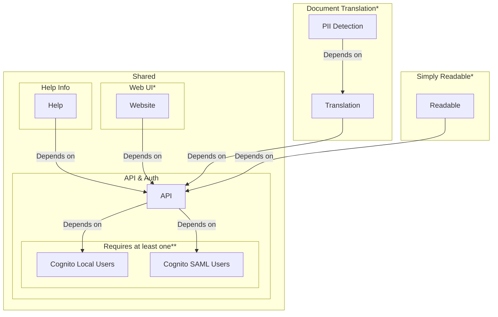

<!--
Copyright Amazon.com, Inc. or its affiliates. All Rights Reserved.
SPDX-License-Identifier: MIT-0
-->

This app is created with a modular architecture to enable the growth of future capabilities and managability of the code. There are shared features and non-shared features. Shared features are deployed for all configurations whilst non-shared features are only deployed when those features are enabled. 

This documentation is split with that in mind. This page will cover a high level overview of how these modules are interconnected, leaving module specific details to their respective pages in this documentation.

## Feature Overview

### Shared Features

  
  
  


### Feature Specific

  
  


## Feature Dependency 

**Key**: \* Optional. \*\* Requires at least one.

## Feature Architecture
This overview shows how the differnt features are interconnected via the various services. For a detailed view of a feature please refer to the specific page for that in this documentation.

