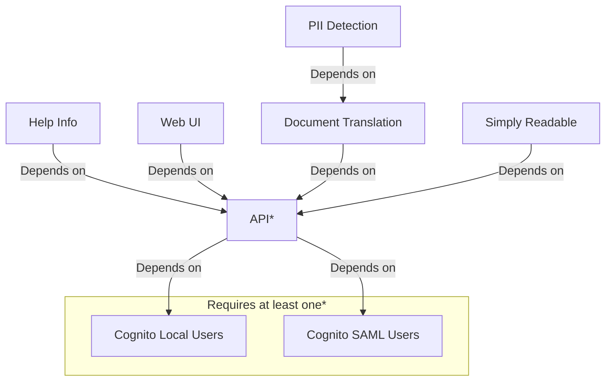

<!--
Copyright Amazon.com, Inc. or its affiliates. All Rights Reserved.
SPDX-License-Identifier: MIT-0
-->

This app is created with a modular architecture. Some aspects of the architecture are `shared` across all configurations. Other aspects are only deployed if the relevant feature is deployed. This documentation splits out the architecture into features.


  


  
  


The solution is built with modular features in mind allowing you to enable or disable particular features that you need. The below shows the feature dependencies.

The below shows the optional features available.

| Feature             | Depends On  | Required  | Description                                                                 |
| ------------------- | ----------- | --------- | --------------------------------------------------------------------------- |
| Web UI              | -           | Optional  | A web UI for interacting with the solution                                  |
| Translation         | -           | Optional  | Performs translation of uploaded documents                                  |
| Translation PII     | Translation | Optional  | Performs Pii detection on uploaded files for more strict lifecycle policies |
| Readable            | -           | Optional  | Performs text simplification for documents                                  |
| Cognito Local Users | -           | Optional* | Provides user authentication with local Cognito users                       |
| Cognito SAML Users  | -           | Optional* | Provides user authentication with a SAML provider                           |

\* At least one of "Cognito Local Users", "Cognito SAML Users" is required.

This overview shows how the different components are interconnected and where module boundaries lie. The "Shared" section shows conponents deployed for all users as they are shared by all features. 

